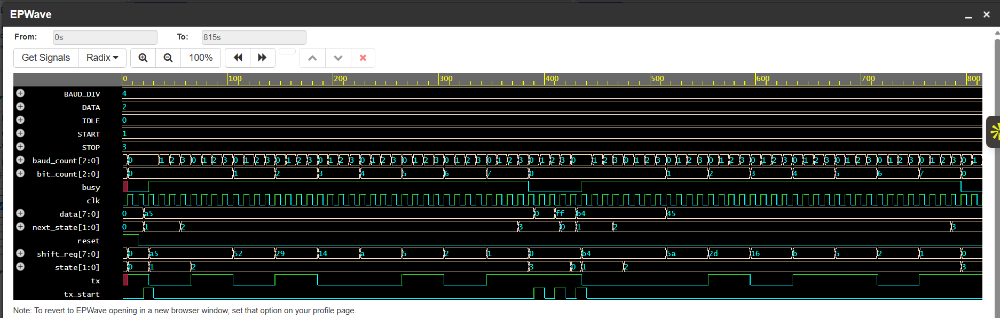
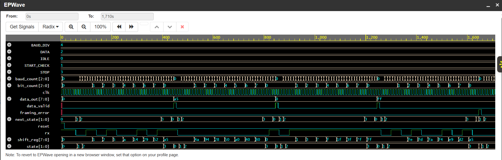
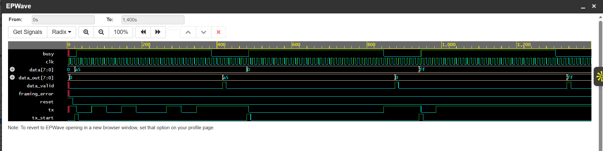

# UART Communication System using Verilog

A UART communication system designed and verified using Verilog HDL.

This project implements a UART Transmitter, UART Receiver, and UART Loopback verification setup.

## Overview

UART (Universal Asynchronous Receiver-Transmitter) is a serial communication protocol used for asynchronous data transmission between digital systems.

This project consists of:

- UART Transmitter (TX)
- UART Receiver (RX)
- UART Loopback verification

The designs use FSM-based control, shift registers, baud-rate counters, and bit counters for serial data transmission and reception.

## UART Frame Format

The UART transmission uses the following frame format:

| Idle | Start | 8 Data Bits | Stop |
|------|-------|-------------|------|
| 1    | 0     | LSB First   | 1    |

Each transmitted byte consists of:

- 1 Start bit
- 8 Data bits
- 1 Stop bit

Data is transmitted and received LSB first.

## UART Transmitter

The UART transmitter converts 8-bit parallel data into a serial bit stream.

### Features

- 8-bit data transmission
- LSB-first transmission
- Start-bit generation
- Stop-bit generation
- Busy signal
- Parameterized baud-rate divider
- FSM-based control
- Shift-register based transmission

## UART Receiver

The UART receiver detects the incoming serial data, reconstructs the original 8-bit data, and validates the received frame.

### Features

- Start-bit detection
- Start-bit validation
- 8-bit serial data reception
- LSB-first reception
- Stop-bit validation
- Data-valid indication
- Framing-error detection
- FSM-based control
- Shift-register based reception

## UART Loopback

The UART loopback test integrates the UART transmitter and receiver to verify end-to-end serial communication.

In the loopback configuration, the serial output of the UART transmitter is directly connected to the serial input of the UART receiver.

```text
        8-bit Data
            |
            v
     +--------------+
     |  UART TX     |
     | Transmitter  |
     +--------------+
            |
            | Serial Data
            v
     +--------------+
     |  UART RX     |
     |  Receiver    |
     +--------------+
            |
            v
       Received Data
```
## Simulation Results

The UART modules were simulated and verified using Icarus Verilog and EPWave.

### UART Transmitter

The transmitter waveform verifies the FSM state transitions, baud-rate counting, bit counting, shift-register operation, and serial TX output.



### UART Receiver

The receiver waveform verifies start-bit detection, data reception, bit counting, shift-register operation, data reconstruction, and stop-bit validation.



### UART Loopback

The loopback waveform verifies the complete TX-to-RX communication path and confirms correct data transfer without framing errors.



## Project Structure

| File | Description |
|------|-------------|
| `uart_tx.v` | UART transmitter RTL design |
| `uart_tx_tb.v` | Testbench for UART transmitter |
| `uart_rx.v` | UART receiver RTL design |
| `uart_rx_tb.v` | Testbench for UART receiver |
| `uart_loopback.v` | UART TX and RX integrated loopback design |
| `uart_loopback_tb.v` | Testbench for UART loopback verification |

## Verification

The UART designs were verified using dedicated Verilog testbenches.

### Test Cases

| Test Case | Transmitted Data | Expected Received Data | Result |
|-----------|------------------|------------------------|--------|
| Case 1 | `8'hA5` | `8'hA5` | PASS |
| Case 2 | `8'h00` | `8'h00` | PASS |
| Case 3 | `8'hFF` | `8'hFF` | PASS |

The UART loopback test successfully verified end-to-end communication between the transmitter and receiver.

The received data matched the transmitted data for all test cases, with `data_valid = 1` and `framing_error = 0`.

## Tools & Technologies

- Verilog HDL
- Icarus Verilog
- EDA Playground
- EPWave
- GitHub

## Key Concepts Demonstrated

- Finite State Machines (FSM)
- Sequential and combinational logic
- Shift registers
- Baud-rate generation
- Bit counting
- Serial communication
- RTL design
- Testbench development
- Functional verification

## Author

**Arpita Kattul**

